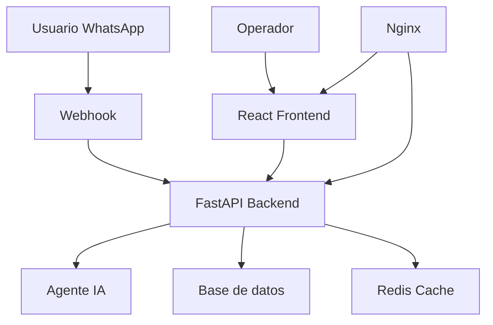

# 🤖 Tony - Asistente de WhatsApp

**Monorepo completo** para el asistente de WhatsApp especializado en RRHH y gestión laboral.

## 📁 Estructura del Proyecto

```
tony-whatsapp-assistant/
├── 📚 backend/          # API FastAPI + Agente IA
│   ├── src/             # Código fuente
│   ├── tests/           # Tests unitarios
│   ├── config/          # Configuraciones
│   └── Dockerfile       # Imagen Docker
├── 🎨 frontend/         # Interfaz React
│   ├── src/             # Código fuente
│   ├── tests/           # Tests de componentes
│   └── Dockerfile       # Imagen Docker
├── 🐳 docker/           # Configuraciones Docker
│   ├── docker-compose.yml
│   └── nginx.conf
├── 🚀 scripts/          # Scripts de despliegue
│   ├── deploy-local.sh  # Linux/macOS
│   └── deploy-local.ps1 # Windows
├── 🧪 tests/            # Tests de integración
│   ├── integration/     # Tests E2E
│   └── e2e/             # Tests de usuario
├── 📖 docs/             # Documentación
├── 🔧 .github/          # CI/CD workflows
│   └── workflows/
└── 🤝 shared/           # Código compartido
```

## 🚀 Inicio Rápido

### Prerrequisitos
- Docker & Docker Compose
- Node.js 18+ (para desarrollo)
- Python 3.10+ (para desarrollo)

### Despliegue Completo
```bash
# Script automático (recomendado)
./scripts/deploy-local.sh

# O manualmente
docker-compose -f docker/docker-compose.yml up --build
```

### Desarrollo Local
```bash
# Backend
cd backend
pip install -r src/requerimientos.txt
python src/main.py

# Frontend
cd frontend
npm install
npm run dev
```

## 📊 Servicios

| Servicio | URL | Descripción |
|----------|-----|-------------|
| **Frontend** | http://localhost | Interfaz de gestión |
| **Backend API** | http://localhost/api | API REST |
| **Docs** | http://localhost/docs | Swagger UI |
| **Health** | http://localhost/health | Estado del sistema |

## 🛠️ Desarrollo

### Backend (FastAPI)
- **Lenguaje**: Python 3.10+
- **Framework**: FastAPI
- **IA**: LangChain + OpenAI
- **Base de datos**: Supabase
- **Cache**: Redis

### Frontend (React)
- **Lenguaje**: TypeScript
- **Framework**: React 18
- **Styling**: Tailwind CSS
- **Build**: Vite
- **Estado**: React Context

## 🧪 Testing

```bash
# Tests unitarios backend
cd backend && pytest

# Tests unitarios frontend
cd frontend && npm test

# Tests de integración
cd tests && npm run test:integration

# Tests E2E
cd tests && npm run test:e2e
```

## 📦 Despliegue

### Desarrollo
```bash
docker-compose -f docker/docker-compose.yml up
```

### Producción
```bash
docker-compose -f docker/docker-compose.prod.yml up
```

## 🔧 Configuración

### Variables de Entorno
```env
# Backend
OPENAI_API_KEY=tu_clave_openai
SUPABASE_URL=tu_url_supabase
SUPABASE_KEY=tu_clave_supabase
WHATSAPP_TOKEN=tu_token_whatsapp

# Frontend
VITE_API_BASE_URL=http://localhost/api
```

## 🤝 Contribuir

1. Fork el proyecto
2. Crea una rama: `git checkout -b feature/nueva-funcionalidad`
3. Commit: `git commit -m 'Agregar nueva funcionalidad'`
4. Push: `git push origin feature/nueva-funcionalidad`
5. Abre un Pull Request

## 📝 Licencia

Este proyecto está bajo la Licencia MIT.

## 🆘 Soporte

- 📧 Email: tu@email.com
- 📖 Documentación: [docs/](./docs/)
- 🐛 Issues: [GitHub Issues](https://github.com/tu-usuario/tony-whatsapp-assistant/issues)

---

## 🎯 Arquitectura



## 🔄 Pipeline CI/CD

- ✅ **Linting**: ESLint, Pylint
- ✅ **Testing**: Jest, Pytest
- ✅ **Security**: Dependabot
- ✅ **Build**: Docker multi-stage
- ✅ **Deploy**: Automated with GitHub Actions

**¡Listo para producción!** 🚀 