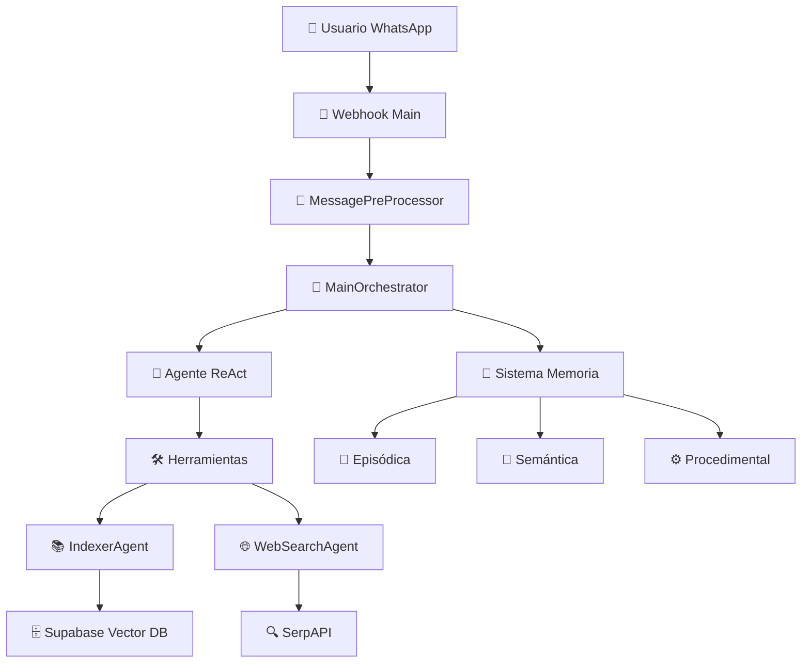

# 🤖 TONY - Asistente Inteligente de RRHH

**TONY** es un asistente de recursos humanos inteligente que se conecta a WhatsApp para responder consultas laborales. Utiliza inteligencia artificial avanzada con patrones **ReAct** (Reasoning and Acting) para proporcionar respuestas precisas basadas en documentos internos de la empresa y búsquedas web.

## 🎯 **Características Principales**

### 🧠 **Sistema de Memoria Avanzado**
- **Memoria Episódica**: Recuerda conversaciones y eventos específicos
- **Memoria Semántica**: Almacena conocimiento y conceptos aprendidos  
- **Memoria Procedimental**: Guarda workflows y patrones de resolución exitosos
- **Multi-usuario**: Cada usuario tiene su propia memoria independiente

### 🔄 **Patrón ReAct (Reasoning + Acting)**
- **Razona** antes de actuar
- **Decide** qué herramientas usar según la consulta
- **Itera** hasta encontrar la respuesta completa
- **Optimiza** con early stopping para eficiencia

### 🛠️ **Herramientas Inteligentes**
- **Búsqueda en Documentos**: Acceso a documentos internos de Google Drive
- **Búsqueda Web**: Información actualizada de internet con SerpAPI
- **Corrección Ortográfica**: Mejora automática de mensajes de usuarios
- **Indexación Automática**: Actualización continua de documentos

### 📱 **Integración WhatsApp**
- Webhook oficial de Meta para WhatsApp Business
- Procesamiento asíncrono de mensajes
- Formato de respuestas optimizado para WhatsApp
- Manejo de múltiples usuarios simultáneos

## 🏗️ **Arquitectura del Sistema**



## 🔧 **Componentes Técnicos**

### **1. 📱 main.py - Servidor Principal**
- Servidor **FastAPI** 
- Webhook para recibir mensajes de WhatsApp
- Sistema multi-usuario con limpieza automática
- Endpoints de salud y estadísticas
- Scheduler para tareas automáticas

### **2. 🧠 orquestador.py - Cerebro del Sistema**  
- **MainOrchestrator** con patrón ReAct
- Integración con **LangChain** v0.1.14
- Gestión de herramientas y memoria avanzada
- Prompt personalizado optimizado

### **3. 💾 memoria.py - Sistema de Memoria Híbrido**
- **EpisodicMemory**: Conversaciones temporales
- **SemanticMemory**: Conocimiento persistente
- **ProceduralMemory**: Patrones y workflows
- Almacenamiento en **Supabase**

### **4. 📚 indexador.py - Gestión de Documentos**
- Conexión con **Google Drive API**
- Conversión de documentos con **MarkItDown**
- Generación de embeddings con **OpenAI**
- Búsqueda semántica vectorial

### **5. 🌐 busqueda_Web.py - Búsqueda Externa**
- Integración con **SerpAPI**
- Extracción de contenido de PDFs
- Scraping inteligente de páginas web
- Procesamiento asíncrono

### **6. ⚙️ utilidades.py - Funciones Helper**
- Gestión de credenciales de Google
- Helpers para Supabase
- Configuración centralizada

## 🚀 **Instalación y Configuración**

### **Prerrequisitos**
- Python 3.11+
- Cuenta de WhatsApp Business
- Proyecto de Google Cloud (Drive API)
- Cuenta de Supabase
- API Key de OpenAI
- API Key de SerpAPI

### **1. Clonar el repositorio**
```bash
git clone <tu-repositorio>
cd TrabajoFinalAgentes
```

### **2. Crear entorno virtual**
```bash
python -m venv sailed
# Windows
sailed\Scripts\activate
# Linux/Mac
source sailed/bin/activate
```

### **3. Instalar dependencias**
```bash
pip install -r src/requerimientos.txt
```

### **4. Configurar variables de entorno**
Crear `config/.env`:
```bash
# OpenAI
OPENAI_API_KEY=sk-proj-tu_api_key_aqui

# WhatsApp Business
WHATSAPP_TOKEN=tu_token_de_whatsapp
WHATSAPP_PHONE_ID=tu_phone_id
WEBHOOK_VERIFY_TOKEN=tu_verify_token

# Supabase
SUPABASE_URL=https://tu-proyecto.supabase.co
SUPABASE_KEY=tu_supabase_key

# Google Drive
GOOGLE_DRIVE_FOLDER_ID=tu_folder_id

# SerpAPI
SERP_API_KEY=tu_serp_api_key
```

### **5. Configurar Google Drive**
```bash
# Colocar client_secret.json en config/
# Ejecutar generación de token
python src/generate_token.py
```

### **6. Configurar base de datos**
Ejecutar los scripts SQL en `src/sql/` en tu proyecto Supabase:
- `advanced_memory_tables.sql`
- `chat_history.sql`

### **7. Inicializar sistema**
```bash
python src/main.py
```

## 📊 **Uso del Sistema**

### **Endpoints Disponibles**
- `GET /health` - Estado del servidor
- `GET /users/stats` - Estadísticas de usuarios activos  
- `GET /webhook` - Verificación de webhook WhatsApp
- `POST /webhook` - Recepción de mensajes WhatsApp

### **Comandos de Usuario (WhatsApp)**
Los usuarios pueden hacer consultas naturales como:
- "¿Cómo se calcula la CTS?"
- "¿Cuántas vacaciones me tocan?"
- "¿Qué dice el reglamento sobre horarios?"
- "¿Cómo solicito un permiso?"

### **Funcionalidades Automáticas**
- ✅ **Corrección ortográfica** automática de mensajes
- ✅ **Indexación** periódica de documentos (cada 60 min)
- ✅ **Limpieza de memoria** de usuarios inactivos (cada 15 min)
- ✅ **Respuestas contextualizadas** basadas en historial
- ✅ **Búsqueda inteligente** en documentos y web

## 🧠 **Flujo de Procesamiento**

1. **Recepción**: Usuario envía mensaje por WhatsApp
2. **Preprocesamiento**: Corrección ortográfica automática
3. **Orquestación**: Análisis de consulta y selección de herramientas
4. **Razonamiento**: Patrón ReAct para encontrar información
5. **Búsqueda**: En documentos internos y/o web según necesidad
6. **Memoria**: Almacenamiento de interacción para futuras consultas
7. **Respuesta**: Mensaje formateado enviado por WhatsApp

## 📈 **Métricas y Monitoreo**

- **Usuarios activos** por período
- **Herramientas utilizadas** por consulta
- **Tasa de éxito** de procedimientos
- **Tiempo de respuesta** promedio
- **Memoria utilizada** por usuario

## 🔒 **Seguridad**

- Autenticación OAuth2 para Google Drive
- API Keys encriptadas en variables de entorno
- Validación de webhooks de WhatsApp
- Limpieza automática de datos inactivos
- Manejo seguro de tokens y credenciales

## 🛠️ **Tecnologías Utilizadas**

| Categoría | Tecnología | Versión |
|-----------|------------|---------|
| **Backend** | Python | 3.11+ |
| **Framework** | Quart (Async Flask) | 0.18.4 |
| **IA** | LangChain | 0.1.14 |
| **LLM** | OpenAI GPT-4o-mini | - |
| **Embeddings** | OpenAI Ada-002 | - |
| **Base de Datos** | Supabase (PostgreSQL) | - |
| **Mensajería** | WhatsApp Business API | - |
| **Documentos** | Google Drive API | v3 |
| **Búsqueda Web** | SerpAPI | - |
| **Procesamiento** | MarkItDown, BeautifulSoup | - |

## 📋 **Estructura del Proyecto**

```
TrabajoFinalAgentes/
├── config/
│   ├── .env                    # Variables de entorno
│   ├── client_secret.json      # Credenciales Google
│   └── token.json             # Token de acceso Google
├── src/
│   ├── main.py                # Servidor principal
│   ├── orquestador.py         # Orquestador ReAct
│   ├── memoria.py             # Sistema de memoria
│   ├── indexador.py           # Indexación de documentos
│   ├── busqueda_Web.py        # Búsqueda web
│   ├── utilidades.py          # Funciones helper
│   ├── generate_token.py      # Generador de tokens
│   ├── requerimientos.txt     # Dependencias
│   └── sql/                   # Scripts de base de datos
└── README.md                  # Este archivo
```

## 🎯 **Casos de Uso**

### **Para Empresas**
- Automatización de consultas de RRHH
- Acceso 24/7 a información laboral
- Reducción de carga de trabajo del área de RRHH
- Centralización de conocimiento empresarial

### **Para Empleados**  
- Consultas instantáneas sobre beneficios
- Acceso rápido a reglamentos y políticas
- Información actualizada sobre procedimientos
- Historial de consultas personalizadas

## 🔮 **Roadmap Futuro**

- [ ] Integración con sistemas de nómina
- [ ] Soporte para múltiples idiomas
- [ ] Dashboard web para administradores
- [ ] Integración con Slack/Teams
- [ ] API REST para terceros
- [ ] Análisis predictivo de consultas

## 👨‍💻 **Contribución**

Este proyecto utiliza tecnologías modernas de IA para resolver problemas reales en gestión de recursos humanos. Las contribuciones son bienvenidas siguiendo las mejores prácticas de desarrollo.

## 📄 **Licencia**

[Especificar licencia del proyecto]

---

**🤖 TONY - Tu asistente inteligente de RRHH, siempre disponible cuando lo necesites.** 
