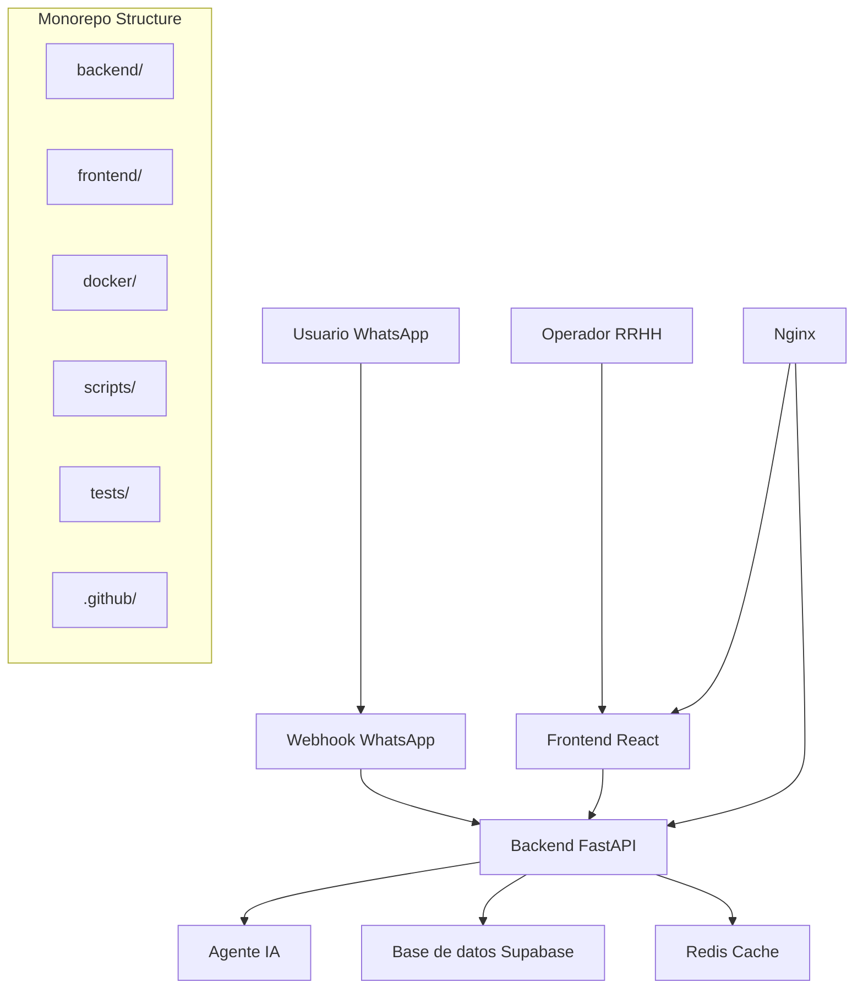

# 🏗️ Arquitectura - Tony WhatsApp Assistant

Este documento describe la arquitectura del sistema Tony, organizado como monorepo.

## 📊 Visión General

Tony es un asistente de WhatsApp especializado en RRHH que combina inteligencia artificial con una interfaz web para gestión de conversaciones.



## 🔧 Componentes Principales

### 1. Backend (FastAPI)
**Ubicación**: `backend/`

- **Lenguaje**: Python 3.10+
- **Framework**: FastAPI
- **IA**: LangChain + OpenAI GPT-4
- **Base de datos**: Supabase (PostgreSQL)
- **Cache**: Redis
- **Autenticación**: Token-based

**Estructura**:
```
backend/
├── src/
│   ├── main.py              # Punto de entrada
│   ├── orquestador.py       # Lógica del agente IA
│   ├── memoria.py           # Sistema de memoria
│   ├── indexador.py         # Indexación de documentos
│   ├── database_manager.py  # Gestión de BD
│   └── models.py            # Modelos Pydantic
├── config/
│   ├── client_secret.json   # Credenciales Google
│   └── token.json           # Tokens de acceso
├── tests/
└── Dockerfile
```

### 2. Frontend (React + TypeScript)
**Ubicación**: `frontend/`

- **Lenguaje**: TypeScript
- **Framework**: React 18
- **Build Tool**: Vite
- **Styling**: Tailwind CSS
- **Estado**: React Context
- **UI Components**: Lucide React

**Estructura**:
```
frontend/
├── src/
│   ├── components/          # Componentes reutilizables
│   │   ├── ChatArea.tsx     # Área de chat
│   │   ├── ConversationList.tsx
│   │   └── AdminDashboard.tsx
│   ├── services/
│   │   └── api.ts           # Cliente API
│   ├── types/
│   │   └── index.ts         # Tipos TypeScript
│   ├── App.tsx              # Componente principal
│   └── main.tsx             # Punto de entrada
├── public/
├── tests/
└── Dockerfile
```

### 3. Docker & Orquestación
**Ubicación**: `docker/`

- **Orquestación**: Docker Compose
- **Proxy**: Nginx
- **Cache**: Redis
- **Health Checks**: Configurados en todos los servicios

### 4. CI/CD
**Ubicación**: `.github/workflows/`

- **Backend CI**: Tests, linting, security scans
- **Frontend CI**: Tests, build, E2E tests
- **Deploy**: Despliegue automatizado
- **Security**: Scans de vulnerabilidades

## 🔄 Flujo de Datos

### 1. Flujo de Mensaje WhatsApp
```
WhatsApp → Webhook → FastAPI → Preprocessor → Orquestador → IA → Respuesta
```

### 2. Flujo de Interfaz Web
```
Operador → React Frontend → API REST → Backend → Base de datos
```

### 3. Flujo de Memoria
```
Consulta → Memoria por Usuario → Vector Store → Búsqueda Semántica → Contexto
```

## 🎯 Patrones de Diseño

### 1. **Microservicios Ligeros**
- Separación clara entre frontend y backend
- Comunicación vía API REST
- Escalabilidad independiente

### 2. **Orquestador Central**
- Patrón Orchestrator para la lógica de IA
- Gestión centralizada de memoria por usuario
- Pipeline de procesamiento de mensajes

### 3. **Repository Pattern**
- Abstracción de acceso a datos
- Interfaces claras para diferentes stores
- Fácil testing y mocking

### 4. **Event-Driven Architecture**
- Webhooks para eventos de WhatsApp
- Procesamiento asíncrono
- Scheduler para tareas recurrentes

## 🔐 Seguridad

### 1. **Autenticación & Autorización**
- Verificación de tokens de WhatsApp
- Validación de números telefónicos autorizados
- Variables de entorno para credenciales

### 2. **Validación de Datos**
- Pydantic models para validación
- Sanitización de inputs
- Rate limiting

### 3. **Secrets Management**
- Variables de entorno para credenciales
- Archivos de configuración excluidos de Git
- Rotación de tokens

## 📊 Monitoreo & Observabilidad

### 1. **Health Checks**
- Endpoints de salud en todos los servicios
- Verificación de dependencias
- Métricas de disponibilidad

### 2. **Logging**
- Logs estructurados
- Niveles de log apropiados
- Agregación de logs

### 3. **Métricas**
- Estadísticas de usuarios activos
- Performance de respuestas
- Uso de memoria por usuario

## 🚀 Despliegue

### 1. **Desarrollo Local**
```bash
# Opción 1: Docker Compose
./scripts/deploy-local.sh

# Opción 2: Desarrollo nativo
cd backend && python src/main.py
cd frontend && npm run dev
```

### 2. **Staging/Producción**
```bash
# Con variables de entorno
docker-compose -f docker/docker-compose.yml up -d

# Con CI/CD
git push origin main  # Trigger automático
```

## 🔧 Configuración por Entorno

### Development
- Hot reload activado
- Logs verbosos
- Debug habilitado
- Datos de prueba

### Staging
- Configuración similar a producción
- Tests de integración
- Datos sintéticos
- Monitoreo básico

### Production
- Optimizaciones de rendimiento
- Logs mínimos
- Seguridad hardened
- Monitoreo completo
- Backups automáticos

## 📚 Dependencias Externas

### 1. **APIs Externas**
- **OpenAI**: GPT-4 para IA conversacional
- **WhatsApp Business API**: Comunicación con usuarios
- **Supabase**: Base de datos y autenticación
- **Google Drive**: Almacenamiento de documentos

### 2. **Servicios de Infraestructura**
- **Redis**: Cache y sesiones
- **Nginx**: Proxy reverso y load balancing
- **Docker**: Containerización
- **GitHub Actions**: CI/CD

## 🔄 Escalabilidad

### 1. **Horizontal Scaling**
- Multiple instancias del backend
- Load balancing con Nginx
- Redis compartido entre instancias

### 2. **Vertical Scaling**
- Incremento de recursos por container
- Optimización de memoria por usuario
- Cleanup automático de memorias inactivas

### 3. **Database Scaling**
- Read replicas en Supabase
- Indexación optimizada
- Connection pooling

## 🐛 Debugging & Troubleshooting

### 1. **Logs Comunes**
```bash
# Logs generales
docker-compose logs -f

# Backend específico
docker-compose logs -f backend

# Frontend específico
docker-compose logs -f frontend
```

### 2. **Health Checks**
```bash
# Sistema completo
curl http://localhost/health

# Backend directo
curl http://localhost:8000/health

# Frontend
curl http://localhost:3000
```

### 3. **Debugging de IA**
- Logs de procesamiento de mensajes
- Trazas de memoria por usuario
- Métricas de performance de consultas

## 📈 Métricas Clave

### 1. **Performance**
- Tiempo de respuesta promedio < 3s
- Disponibilidad > 99%
- Tasa de error < 1%

### 2. **Uso**
- Usuarios activos simultáneos
- Mensajes procesados por hora
- Uso de memoria por usuario

### 3. **Calidad**
- Satisfacción de respuestas IA
- Tasa de escalamiento a humano
- Tiempo de resolución 